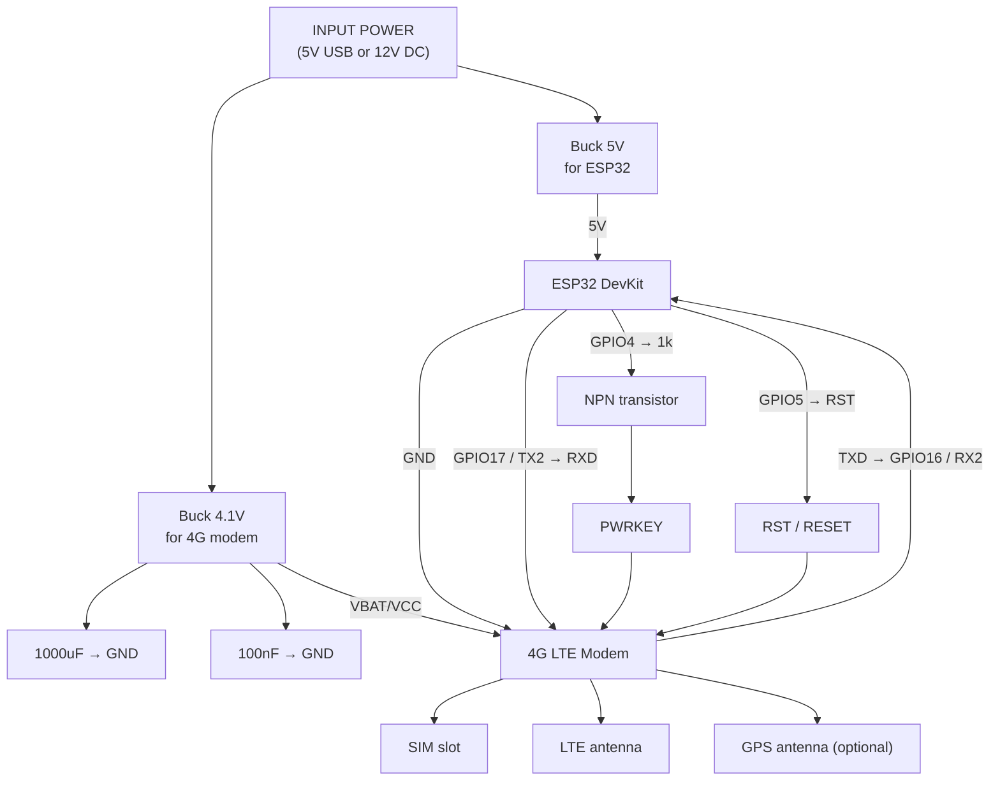

# Project: Communication and Telemetry Node based on ESP32 and 4G LTE Modem

## 1. Purpose

This device is designed to provide remote communication and telemetry over a cellular network. The system is built around an ESP32 microcontroller that controls a 4G LTE modem, communicates with it via UART, and manages its power-on and hardware reset.

Typical applications:

- Remote home/plot automation
- Remote monitoring
- GSM/LTE gateway
- GPS/LTE tracker
- Backup communication channel
- Alerting and telemetry

## 2. System overview

Input power is provided as 5V USB or 12V DC and split into two independent rails:

- Buck 5V — powers the ESP32 controller
- Buck 4.1V — powers the 4G LTE modem (VBAT/VCC)

The ESP32 acts as the main controller and is responsible for:

- powering up the modem
- controlling hardware reset
- sending AT commands
- reading modem responses
- processing telemetry
- sending data over the cellular network

## 3. Device components

### 3.1 Main units

- Input power: 5V USB or 12V DC
- Buck 5V regulator for ESP32
- Buck 4.1V regulator for LTE modem
- ESP32 DevKit
- 4G LTE modem
- SIM slot
- LTE antenna
- GNSS / GPS antenna (optional)

### 3.2 Support components and control lines

- 1000 µF power capacitor for the modem
- 100 nF decoupling capacitor for the modem
- 1 kΩ resistor in the PWRKEY control line
- NPN transistor to drive PWRKEY
- RST / RESET line from ESP32 to the modem

## 4. Electrical connections

### 4.1 Power

#### Input
- INPUT POWER: 5V USB or 12V DC

#### ESP32 power rail
- Input goes to Buck 5V
- Buck 5V output feeds the ESP32 DevKit

#### Modem power rail
- Input goes to Buck 4.1V
- Buck 4.1V output feeds modem VBAT/VCC

#### Power filtering for the modem
Install:

- 1000 µF → GND
- 100 nF → GND

Purpose:

- compensate for short current peaks
- suppress voltage dips
- improve modem stability during transmissions

### 4.2 Signal connections

#### UART interface
UART is used between ESP32 and LTE modem:

- ESP32 GPIO17 / TX2 → modem RXD
- modem TXD → ESP32 GPIO16 / RX2
- GND ESP32 ↔ GND modem

#### Modem power-on control
PWRKEY control:

- ESP32 GPIO4 → 1 kΩ resistor → NPN transistor → modem PWRKEY

This allows the ESP32 to generate a pulse equivalent to pressing the modem's power button.

#### Hardware reset
Hardware reset line:

- ESP32 GPIO5 → modem RST / RESET

This enables forced modem reboot without cutting main power.

## 5. Operation logic

### Step 1: Power applied
Both DC-DC converters power up:

- 5V rail for ESP32
- 4.1V rail for LTE modem

### Step 2: ESP32 boots
ESP32 starts as the main controller.

### Step 3: Modem preparation
The modem receives VBAT/VCC but requires PWRKEY activation to enter operational mode.

### Step 4: Powering the modem
ESP32 pulses GPIO4 which, via the resistor and NPN transistor, toggles PWRKEY to start the modem.

### Step 5: Link initialization
After power-up the ESP32 opens UART communication and sends AT commands to:

- verify modem responses
- check SIM status
- register on the network
- configure PDP context and data channel
- enable additional features like GNSS

### Step 6: Normal operation
Once registered, the system can:

- transmit telemetry
- send messages
- publish data to servers
- transmit location coordinates
- send alerts and status updates

### Step 7: Recovery from failure
If the modem becomes unresponsive:

- ESP32 can trigger hardware reset via GPIO5 → RST
- modem re-initializes and returns to operation without cutting power

## 6. ESP32 responsibilities

ESP32 tasks in this architecture:

- modem power control
- generating `PWRKEY` pulse
- hardware reset via `RST`
- UART communication
- AT command processing
- telemetry and high-level control logic

ESP32 is the main controller; the LTE modem is a communication peripheral.

## 7. Signal specification

| Signal | Source | Destination | Purpose |
|---|---|---|---|
| 5V | Buck 5V | ESP32 DevKit | ESP32 power |
| 4.1V / VBAT | Buck 4.1V | LTE modem | Modem power |
| GND | common | ESP32 + LTE modem | Common ground |
| GPIO17 / TX2 | ESP32 | modem RXD | Commands to modem |
| TXD | modem | GPIO16 / RX2 ESP32 | Responses from modem |
| GPIO4 | ESP32 | NPN transistor | PWRKEY control |
| PWRKEY | NPN transistor | LTE modem | Power-on control |
| GPIO5 | ESP32 | modem RST | Hardware reset |

## 8. Advantages of this design

- Separate power rails for controller and modem
- Robust handling of LTE modem current spikes
- Controlled power-on via `PWRKEY`
- Hardware reset via `RST`
- Easy telemetry and sensor integration
- Suitable for remote autonomous systems

## 9. Technical notes

### 9.1 Modem power
LTE modems can draw large current peaks during registration and transmission. The power supply and DC-DC converter must support these peaks.

### 9.2 Capacitors
Place the 1000 µF capacitor as close as possible to the modem VBAT/VCC input; the 100 nF should be placed nearby as a high-frequency decoupling capacitor.

### 9.3 Common ground
ESP32 and modem must share ground, otherwise UART and control signals may be unstable.

### 9.4 Logic levels
Verify UART, PWRKEY and RST logic levels against the modem datasheet before connecting.

### 9.5 PWRKEY/RST behavior
Pulse polarity, required pulse duration, and wiring depend on the specific LTE module — consult the modem documentation.

## 10. Summary

A communication node built with `ESP32 + 4G LTE modem` featuring separate power rails, UART interface, and two control lines:

- `GPIO4 → transistor → PWRKEY` — modem power-on
- `GPIO5 → RST` — modem hardware reset

This ensures reliable modem startup, control and recovery, suitable for autonomous telemetry systems.

## 11. Controller software

The ESP32 runs a web server and implements multi-room temperature monitoring with gas heater control.

### 11.1 Overview

On boot the controller connects to WiFi with a static IP (`192.168.0.100`), starts an HTTP server on port 80, and enters its main loop:

1. **Poll sensor nodes** every 10 seconds — sends `GET /data` to each of the 3 Wemos D1 Mini nodes (Bedroom `.101`, Kitchen `.102`, Living Room `.103`) and stores their temperature/humidity readings.
2. **Apply heater logic** after each poll cycle (see §11.3).
3. **Serve the web dashboard** and JSON data endpoint to any browser/client on the local network.
4. **Process incoming SMS** from the GSM module (SIM800L on UART2) in a non-blocking fashion between polls.

### 11.2 HTTP endpoints

| Method | Path | Description |
|--------|------|-------------|
| `GET` | `/` | HTML dashboard with room cards, heater panel, and client-side JS that polls `/data` every 10 s |
| `GET` | `/data` | JSON status of the entire system (see schema below) |
| `GET` | `/heater/on` | Force heater ON, redirects to `/` |
| `GET` | `/heater/off` | Force heater OFF, redirects to `/` |
| `GET` | `/heater/auto` | Set heater to AUTO mode, redirects to `/` |

#### `GET /data` response schema

```json
{
  "heater": true,
  "mode": "auto",
  "rooms": [
    { "name": "Bedroom",     "temp": 21.5, "humidity": 48.0, "online": true,  "error": "" },
    { "name": "Kitchen",     "temp": 20.2, "humidity": 55.0, "online": true,  "error": "" },
    { "name": "Living Room", "temp": 0.0,  "humidity": 0.0,  "online": false, "error": "HTTP -1" }
  ]
}
```

| Field | Type | Description |
|-------|------|-------------|
| `heater` | boolean | Current relay state (`true` = ON) |
| `mode` | string | `"auto"`, `"force_on"`, or `"force_off"` |
| `rooms[].name` | string | Room name |
| `rooms[].temp` | float | Last known temperature in °C |
| `rooms[].humidity` | float | Last known relative humidity in % |
| `rooms[].online` | boolean | Whether the node responded to the last poll |
| `rooms[].error` | string | Error description when offline, empty string when online |

### 11.3 Heater logic

The heater has three modes:

- **AUTO** — relay turns ON when **any** online room drops below `TEMP_THRESHOLD` (default 20.0 °C) and turns OFF only when **all** online rooms exceed `TEMP_THRESHOLD + HYSTERESIS` (default 20.5 °C). This prevents rapid toggling near the threshold.
- **FORCE_ON** — relay is always ON regardless of temperatures.
- **FORCE_OFF** — relay is always OFF regardless of temperatures.

SMS alerts are sent to the admin phone **only on state transitions**:
- `ALERT` when temperature first drops below the threshold (heater turns ON).
- `INFO` when all rooms recover above threshold + hysteresis (heater turns OFF).

### 11.4 SMS commands

The controller accepts SMS commands **only from `ADMIN_PHONE`** — other senders are silently ignored.

| Command | Response |
|---------|----------|
| `STATUS` | Replies with current temp/humidity for all rooms and heater state |
| `HEATER ON` | Forces heater ON, confirms via SMS |
| `HEATER OFF` | Forces heater OFF, confirms via SMS |
| `HEATER AUTO` | Returns heater to auto mode, confirms via SMS |

### 11.5 Dashboard

The web dashboard at `/` displays:

- **Room cards** — temperature, humidity, online/offline status, and error details for each room.
- **Heater panel** — current relay state (ON/OFF), mode selector (Auto/Manual), and manual ON/OFF buttons.
- **Auto threshold info** — shows the configured threshold and hysteresis values.
- **Polling indicator** — "last updated HH:MM:SS" timestamp that updates on each successful fetch, with a brief green flash. Shows "update failed — retrying…" on network errors.

The dashboard uses client-side JavaScript to fetch `/data` every 10 seconds and update the DOM without full page reloads.

## 12. Mermaid diagram


