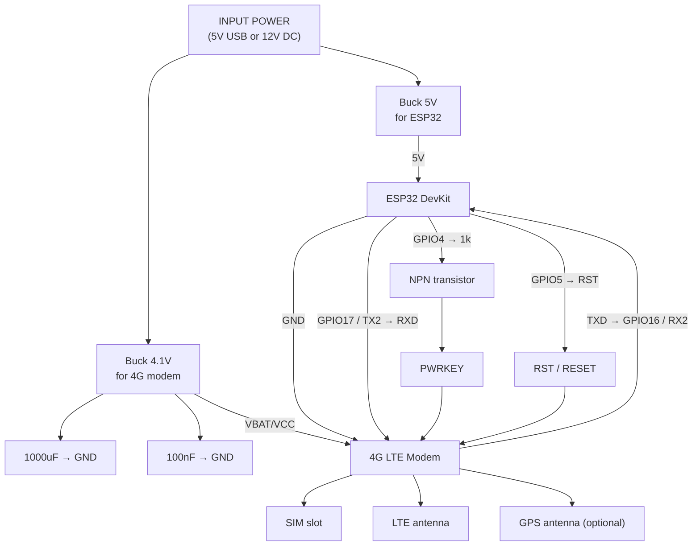

# Проект: узел связи и телеметрии на базе ESP32 и 4G LTE модема

## 1. Назначение

Устройство предназначено для организации удалённой связи и передачи телеметрии через мобильную сеть. Основой системы является микроконтроллер **ESP32**, который управляет **4G LTE модемом**, обменивается с ним данными по UART и контролирует его включение и аппаратный сброс.

Решение может применяться в следующих сценариях:

- дачная автоматика
- удалённый мониторинг
- GSM/LTE-шлюз
- GPS/LTE-трекер
- резервный канал связи
- аварийные уведомления и телеметрия

---

## 2. Общая структура системы

На вход устройства подаётся питание **5V USB** или **12V DC**. Далее питание разделяется на две независимые линии:

- **Buck 5V** — питание контроллера **ESP32 DevKit**
- **Buck 4.1V** — питание **4G LTE модема** по линии **VBAT/VCC**

ESP32 выполняет функции основного контроллера системы:

- запускает модем
- управляет аппаратным сбросом
- отправляет AT-команды
- получает ответы от модема
- обрабатывает телеметрию
- организует передачу данных через мобильную сеть

---

## 3. Состав устройства

### 3.1. Основные узлы

- источник входного питания: **5V USB или 12V DC**
- понижающий DC-DC преобразователь **5V** для ESP32
- понижающий DC-DC преобразователь **4.1V** для LTE-модема
- **ESP32 DevKit**
- **4G LTE modem**
- **SIM slot** для SIM-карты
- **LTE antenna**
- **GNSS/GPS antenna** (опционально)

### 3.2. Обвязка и управляющие элементы

- конденсатор **1000 µF** по питанию модема
- конденсатор **100 nF** по питанию модема
- резистор **1 кОм** в цепи управления PWRKEY
- **NPN-транзистор** для управления входом **PWRKEY**
- линия **RST / RESET** от ESP32 к модему

---

## 4. Электрические соединения

### 4.1. Питание

#### Вход питания
- **INPUT POWER**: 5V USB или 12V DC

#### Линия питания ESP32
- входное питание подаётся на **Buck 5V**
- выход **Buck 5V** подключается к питанию **ESP32 DevKit**

#### Линия питания модема
- входное питание подаётся на **Buck 4.1V**
- выход **Buck 4.1V** подключается к входу питания модема **VBAT/VCC**

#### Фильтрация питания модема
На линии питания модема устанавливаются:

- **1000 µF → GND**
- **100 nF → GND**

Назначение:

- компенсация кратковременных пиков потребления тока
- подавление просадок напряжения
- улучшение стабильности работы модема при передаче данных

### 4.2. Сигнальные соединения

#### UART-интерфейс
Для обмена данными между ESP32 и LTE-модемом используется UART:

- **ESP32 GPIO17 / TX2 → RXD модема**
- **TXD модема → ESP32 GPIO16 / RX2**
- **GND ESP32 ↔ GND модема**

#### Управление включением модема
Для включения модема используется линия **PWRKEY**:

- **ESP32 GPIO4 → резистор 1 кОм → NPN-транзистор → PWRKEY модема**

Данная схема позволяет ESP32 формировать управляющий импульс, эквивалентный нажатию кнопки включения модема.

#### Аппаратный сброс модема
Для принудительного аппаратного сброса используется отдельная линия:

- **ESP32 GPIO5 → RST / RESET модема**

Это позволяет перезапустить модем в случае зависания или потери связи без отключения общего питания.

---

## 5. Логика работы

### Шаг 1. Подача питания
После подачи внешнего питания запускаются оба DC-DC преобразователя:

- линия 5V для ESP32
- линия 4.1V для LTE-модема

### Шаг 2. Старт ESP32
ESP32 получает питание и запускается как основной контроллер системы.

### Шаг 3. Подготовка модема
На модем подаётся напряжение питания **VBAT/VCC**, однако для перехода в рабочий режим требуется отдельная активация входа **PWRKEY**.

### Шаг 4. Включение модема
ESP32 формирует сигнал на **GPIO4**, который через резистор **1 кОм** управляет **NPN-транзистором**. Транзистор активирует линию **PWRKEY** модема и тем самым инициирует его запуск.

### Шаг 5. Инициализация связи
После включения модема ESP32 устанавливает обмен по UART и отправляет AT-команды для:

- проверки ответа модема
- определения состояния SIM-карты
- регистрации в сети
- настройки PDP-контекста и канала передачи данных
- запуска дополнительных функций, например GNSS

### Шаг 6. Рабочий режим
После успешной регистрации в сети система может:

- передавать телеметрию
- отправлять сообщения
- публиковать данные на сервер
- передавать координаты
- отправлять аварийные события и статусы

### Шаг 7. Восстановление после сбоя
Если модем перестал отвечать или завис:

- ESP32 может выполнить аппаратный сброс по линии **GPIO5 → RST**
- после сброса модем заново проходит инициализацию
- система возвращается в рабочий режим без полного отключения питания устройства

---

## 6. Функции ESP32 в проекте

ESP32 в данной архитектуре выполняет следующие задачи:

- управление запуском модема
- формирование сигнала **PWRKEY**
- аппаратный сброс модема через **RST**
- обмен данными по UART
- обработка AT-команд и ответов
- передача телеметрии и управляющей логики верхнего уровня

ESP32 является главным контроллером, а LTE-модем — коммуникационным периферийным модулем.

---

## 7. Спецификация сигналов

| Сигнал | Источник | Приёмник | Назначение |
|---|---|---|---|
| 5V | Buck 5V | ESP32 DevKit | Питание ESP32 |
| 4.1V / VBAT | Buck 4.1V | LTE modem | Питание модема |
| GND | Общая шина | ESP32 + LTE modem | Общая земля |
| GPIO17 / TX2 | ESP32 | RXD модема | Передача команд в модем |
| TXD | LTE modem | GPIO16 / RX2 ESP32 | Ответы и данные от модема |
| GPIO4 | ESP32 | NPN-транзистор | Управление PWRKEY |
| PWRKEY | NPN-транзистор | LTE modem | Включение модема |
| GPIO5 | ESP32 | RST модема | Аппаратный сброс |

---

## 8. Преимущества схемы

Предлагаемая архитектура имеет следующие преимущества:

- раздельное питание контроллера и модема
- устойчивость к пиковым токам LTE-модуля
- наличие управляемого включения через **PWRKEY**
- наличие аппаратного сброса через **RST**
- простая интеграция с телеметрией, датчиками и логикой автоматики
- возможность удалённой работы через мобильную сеть

---

## 9. Технические замечания

### 9.1. Питание модема
LTE-модемы могут потреблять значительный импульсный ток, особенно при регистрации в сети и передаче данных. Источник питания и DC-DC преобразователь должны быть рассчитаны на такие пики.

### 9.2. Конденсаторы
Конденсатор **1000 µF** рекомендуется размещать максимально близко к входу питания модема **VBAT/VCC**. Конденсатор **100 nF** должен стоять рядом как высокочастотная развязка.

### 9.3. Общая земля
ESP32 и модем должны иметь общую землю, иначе UART-связь и управляющие сигналы будут работать нестабильно.

### 9.4. Логические уровни
Перед подключением UART, **PWRKEY** и **RST** необходимо проверить допустимые логические уровни конкретного модема по даташиту.

### 9.5. Управление PWRKEY и RST
Полярность сигнала, длительность импульса и допустимая схема подключения для **PWRKEY** и **RST** зависят от конкретной модели LTE-модуля. Эти параметры обязательно нужно сверить с документацией производителя.

---

## 10. Краткое резюме

Проект представляет собой узел удалённой связи на базе **ESP32 + 4G LTE модема** с раздельным питанием, UART-интерфейсом и двумя линиями управления модемом:

- **GPIO4 → транзистор → PWRKEY** — включение модема
- **GPIO5 → RST** — аппаратный сброс модема

Такое решение обеспечивает надёжный запуск, контроль и восстановление работы модема и хорошо подходит для автономных и удалённых систем телеметрии.

---

## 11. Mermaid-схема

